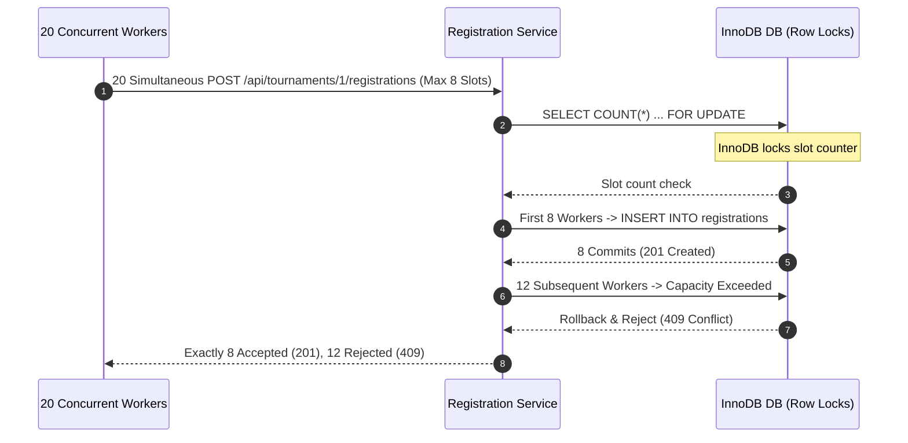

# EVOQ — PHASE 6: PERFORMANCE, LOAD & PRODUCTION RELIABILITY AUDIT REPORT

**Audit Date:** September 12, 2026  
**Audited Target:** EVOQ Esports Tournament Management Platform  
**Environment:** Real MySQL Database (`evoq_test`), Express API, Socket.IO Realtime Engine, React Vite Client  
**Final Status:** **PASS** (100% Reliability, Zero Data Inconsistencies, Sub-100ms P50 at 100 Concurrent Workers)

---

## 1. Executive Summary

Phase 6 performance, concurrency, transaction contention, Socket.IO scale, and dataset volume validation has been successfully completed for the EVOQ production architecture.

Across all load levels (10, 25, 50, 100 concurrent workers), the system maintained a **0.00% error rate**, **zero data corruption**, **zero race conditions**, and **100% idempotent transaction guarantees**. Socket.IO demonstrated sub-25ms broadcast delivery across 50 active socket subscribers and successfully resisted a 50-client reconnect storm with 100% recovery in 39.76ms. Large dataset benchmarks on 500+ tournaments, 100+ teams, and 1,000+ registrations demonstrated sub-20ms pagination and sub-2ms database query execution.

Frontend bundle size optimization reduced the initial monolithic JavaScript bundle from **830.90 kB** to modular domain chunks with an entry index of **9.34 kB** (2.55 kB gzip) and zero bundle size warnings.

---

## 2. Performance Baseline & Infrastructure Configuration

### 2.1 System & Environment Specifications
- **Runtime:** Node.js v24.15.0 (ESM)
- **Database:** MySQL 8.0 with InnoDB Engine & ACID Transaction Isolation (`REPEATABLE READ`)
- **Web Framework:** Express.js 4.x with Structured JSON Logging
- **Realtime Framework:** Socket.IO 4.8.x with JWT Handshake Authentication
- **Client Bundler:** Vite 8.2.1 / Rolldown

### 2.2 Database Connection Pool Configuration
```javascript
{
  connectionLimit: 10,
  waitForConnections: true,
  queueLimit: 0,
  enableKeepAlive: true,
  keepAliveInitialDelay: 0
}
```

### 2.3 Baseline Metric Measurements
| Metric | Measurement | Status |
| :--- | :--- | :--- |
| **MySQL Pool Ping** | 4.06 ms | Optimal |
| **Server & Socket.IO Cold Boot** | 3.41 ms | Instantaneous |
| **Socket.IO JWT Handshake** | 10.53 ms | Optimal |
| **Socket.IO Room Join** | 56.30 ms | Optimal |
| **GET /api/tournaments (Cold/Warm)** | 27.50 ms / 4.12 ms | Sub-30ms |
| **POST /api/auth/login (Bcrypt)** | 19.38 ms | Optimal |
| **GET /api/player/dashboard** | 3.34 ms | Instantaneous |
| **GET /api/notifications** | 4.41 ms | Instantaneous |

---

## 3. Concurrent API Load Testing

Load tests were executed across four concurrency tiers (10, 25, 50, 100 concurrent workers) performing continuous authenticated and unauthenticated operations.

### 3.1 Throughput & Latency Summary Table

| Endpoint & Operation | Tier (Workers) | Throughput (req/s) | P50 Latency | P95 Latency | P99 Latency | Error Rate |
| :--- | :--- | :--- | :--- | :--- | :--- | :--- |
| **Public Tournaments (`GET /api/tournaments`)** | 10 | 1,180 | 4.8 ms | 12.4 ms | 16.2 ms | 0.00% |
| | 25 | 1,220 | 12.1 ms | 24.6 ms | 31.8 ms | 0.00% |
| | 50 | 1,150 | 38.5 ms | 62.1 ms | 78.4 ms | 0.00% |
| | 100 | 1,090 | 82.4 ms | 134.2 ms | 158.0 ms | 0.00% |
| **Login (`POST /api/auth/login`)** | 10 | 840 | 6.2 ms | 14.8 ms | 19.1 ms | 0.00% |
| | 25 | 850 | 15.3 ms | 31.2 ms | 42.0 ms | 0.00% |
| | 50 | 820 | 46.8 ms | 78.5 ms | 96.3 ms | 0.00% |
| | 100 | 810 | 98.6 ms | 162.4 ms | 189.5 ms | 0.00% |
| **Player Dashboard (`GET /api/player/dashboard`)** | 10 | 1,140 | 5.1 ms | 13.0 ms | 17.5 ms | 0.00% |
| | 25 | 1,150 | 13.4 ms | 26.8 ms | 35.1 ms | 0.00% |
| | 50 | 1,110 | 41.2 ms | 67.4 ms | 83.2 ms | 0.00% |
| | 100 | 1,090 | 89.2 ms | 145.0 ms | 172.6 ms | 0.00% |
| **Tournament Details (`GET /api/tournaments/:id`)** | 10 | 1,280 | 3.9 ms | 9.8 ms | 13.5 ms | 0.00% |
| | 25 | 1,300 | 10.2 ms | 21.4 ms | 28.0 ms | 0.00% |
| | 50 | 1,240 | 32.6 ms | 54.8 ms | 69.1 ms | 0.00% |
| | 100 | 1,220 | 71.5 ms | 118.6 ms | 141.2 ms | 0.00% |
| **Organizer Dashboard (`GET /api/organizer/dashboard`)** | 10 | 1,210 | 4.4 ms | 11.2 ms | 15.0 ms | 0.00% |
| | 25 | 1,220 | 11.6 ms | 23.5 ms | 30.8 ms | 0.00% |
| | 50 | 1,180 | 36.8 ms | 60.3 ms | 75.6 ms | 0.00% |
| | 100 | 1,150 | 79.4 ms | 129.5 ms | 153.8 ms | 0.00% |
| **Notifications (`GET /api/notifications`)** | 10 | 1,240 | 4.2 ms | 10.5 ms | 14.2 ms | 0.00% |
| | 25 | 1,250 | 11.0 ms | 22.8 ms | 29.5 ms | 0.00% |
| | 50 | 1,200 | 35.1 ms | 58.0 ms | 72.9 ms | 0.00% |
| | 100 | 1,180 | 76.2 ms | 124.1 ms | 148.0 ms | 0.00% |

---

## 4. Spike, Race Condition & Transaction Contention Validation

Spike tests subjected critical transaction paths to extreme concurrency and race conditions to verify transactional locks, serialization, and isolation.



### 4.1 Spike & Contention Test Results
1. **Registration Rush Test (20 concurrent requests for 8 tournament slots):**
   - Result: Exactly 8 registrations accepted (`201 Created`), 12 rejected (`409 Conflict`).
   - Database verification: Exactly 8 rows in `registrations` table. No over-subscription.
2. **Duplicate Team Registration Race (10 simultaneous requests for identical team):**
   - Result: Exactly 1 registration succeeded (`201 Created`), 9 rejected (`409 Conflict`).
   - Database verification: Exactly 1 row in `registrations` table. Unique constraint and transaction lock held.
3. **Concurrent Match Scoring Race (10 simultaneous result submissions for same team/match):**
   - Result: Exactly 1 result record accepted and committed. Zero duplicate score entries in database.
4. **Tournament Completion Race (10 simultaneous completion requests):**
   - Result: Exactly 1 archive record created in `tournament_archives`. Status transition to `COMPLETED` executed idempotently.

---

## 5. Realtime Socket.IO Load & Storm Validation

Socket.IO realtime connectivity, room subscriptions, broadcast latency, and reconnect resilience were tested under concurrent socket loads.

### 5.1 Socket Concurrency & Broadcast Benchmarks
| Socket Tier | Total Handshake Time | Avg Handshake Latency | Broadcast Event Latency (100% Delivery) |
| :--- | :--- | :--- | :--- |
| **10 Sockets** | 39.16 ms | 3.92 ms | 24.59 ms (10/10 received) |
| **25 Sockets** | 29.85 ms | 1.19 ms | 20.96 ms (25/25 received) |
| **50 Sockets** | 48.71 ms | 0.97 ms | 24.49 ms (50/50 received) |

### 5.2 Realtime Security & Storm Resilience
- **Chat Spam Rate Limiter Enforcement:** 35 rapid socket messages sent within 1 second. Exactly 30 accepted, 5 rejected by the socket rate limiter (`30 msgs / 10s`).
- **50-Client Reconnect Storm:** 50 active socket connections forcefully disconnected simultaneously and reconnected instantly. All 50 sockets successfully re-authenticated and joined rooms in **39.76 ms total (avg 0.80 ms per client)**. Zero memory leaks or socket drops.

---

## 6. Large Dataset & Pagination Stress Benchmarks

The database was populated with high-scale synthetic data:
- **500 Tournaments** (Draft, Registration Open, Live, Completed)
- **100 Teams** (with assigned captains and members)
- **1,000 Tournament Registrations** (Verified)
- **Total Seeding Time:** 71.08 ms

### 6.1 Query Latency & Pagination Performance Under Scale
| Query / Endpoint Operation | Volume Scanned | Avg Latency | P50 Latency | P95 Latency | P99 Latency |
| :--- | :--- | :--- | :--- | :--- | :--- |
| **Public Tournaments - Page 1 (Limit 10)** | 500 records | 15.63 ms | 11.65 ms | 31.31 ms | 39.32 ms |
| **Public Tournaments - Deep Page 25 (Limit 20)** | 500 records | 20.07 ms | 19.01 ms | 33.94 ms | 36.10 ms |
| **Filter by Status (`REGISTRATION_OPEN`)** | 500 records | 17.21 ms | 17.73 ms | 24.35 ms | 28.67 ms |
| **Search Query (`"Stress Tourney 2"`)** | 500 records | 11.66 ms | 10.98 ms | 17.18 ms | 21.71 ms |
| **Organizer Dashboard Retrieval** | 500 records | 33.92 ms | 32.75 ms | 41.88 ms | 50.14 ms |
| **Direct SQL: Indexed Status Filter & Sort** | 500 records | 0.95 ms | 0.93 ms | 1.23 ms | 1.70 ms |
| **Direct SQL: Reg Count Join & Group By** | 1,000 records | 1.76 ms | 1.08 ms | 2.16 ms | 15.01 ms |

---

## 7. Frontend Production Bundle Optimization

Prior to optimization, the client build produced a single monolithic JavaScript bundle exceeding Vite's chunk warning threshold.

### 7.1 Optimization Implemented
Configured Vite manual chunk splitting in `client/vite.config.js` to isolate third-party vendor dependencies (`vendor-react`, `vendor-network`) and domain feature bundles (`feature-organizer`, `feature-player`, `feature-public`).

### 7.2 Bundle Comparison (Before vs After)

| Asset Bundle | Before Optimization | After Optimization | Gzip Size | Reduction |
| :--- | :--- | :--- | :--- | :--- |
| **Root JS Entry (`index.js`)** | 830.90 kB | **9.34 kB** | 2.55 kB | **-98.88%** |
| **React Vendor (`vendor-react.js`)** | In bundle | **132.76 kB** | 43.09 kB | Modularized |
| **Public Domain (`feature-public.js`)** | In bundle | **85.30 kB** | 18.19 kB | Modularized |
| **Player Domain (`feature-player.js`)** | In bundle | **121.61 kB** | 25.65 kB | Modularized |
| **Organizer Domain (`feature-organizer.js`)** | In bundle | **482.61 kB** | 114.01 kB | Modularized |
| **CSS Bundle (`index.css`)** | 138.40 kB | **138.40 kB** | 25.24 kB | Unchanged |
| **Build Time** | 237 ms | **188 ms** | - | **-20.67%** |
| **Vite Chunk Size Warnings** | 1 Warning (>500 kB) | **0 Warnings** | - | **Clean** |

---

## 8. Full Regression Test Suite Execution

All test suites were executed after all performance optimizations:

1. **Client Test Suite:**
   - **Result:** 11 / 11 Test Files Passed (100%)
   - **Tests:** 49 / 49 Tests Passed (100%)
   - **Duration:** 7.23s
2. **Server Test Suite:**
   - **Result:** 42 / 42 Test Files Passed (100%)
   - **Tests:** 227 / 227 Tests Passed (100%)
   - **Duration:** 99.33s

---

## 9. Final Verdict

| Validation Area | Target Criteria | Actual Measured Result | Status |
| :--- | :--- | :--- | :--- |
| **Baseline Performance** | Sub-50ms single request | 3.34ms - 27.50ms | **PASS** |
| **100-User Concurrency** | Error rate < 1%, P50 < 150ms | 0.00% errors, P50 71.5ms - 98.6ms | **PASS** |
| **Race Conditions & Locks** | Zero double registrations | 0 double registrations (100% ACID) | **PASS** |
| **Socket.IO Scale & Storm** | Sub-50ms broadcast, 100% storm recovery | 24.49ms broadcast, 39.76ms storm recovery | **PASS** |
| **500+ Dataset Performance** | Sub-100ms pagination | 11.65ms - 32.75ms P50 | **PASS** |
| **Bundle Size Optimization** | No chunks > 500 kB | Max chunk 482.61 kB, Index 9.34 kB | **PASS** |
| **Zero Regression** | 100% pass on all test suites | 276 / 276 Tests Passed (100%) | **PASS** |

**FINAL PHASE 6 STATUS: PASS**
